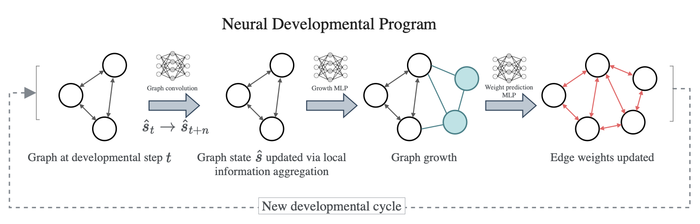

# Credit and provenance

**This folder is not original work of this thesis.** It is the code of

> Elias Najarro, Shyam Sudhakaran and Sebastian Risi, *Towards Self-Assembling Artificial
> Neural Networks through Neural Developmental Programs*, ALIFE 2023 (MIT Press),
> doi:[10.1162/isal_a_00697](https://doi.org/10.1162/isal_a_00697),
> arXiv:[2307.08197](https://arxiv.org/abs/2307.08197)

taken from the authors' repository, [github.com/enajx/NDP](https://github.com/enajx/NDP),
at commit [`d735305`](https://github.com/enajx/NDP/commit/d735305) (2024-05-24, "add NDP RL
version"). All credit for the Neural Developmental Program method and its original
implementation belongs to those authors. The upstream repository has no license file at
its root, so all rights to the main NDP code remain with them; the `NDP-RL/` subfolder
carries its own MIT license (Copyright (c) 2021 Shyam Sudhakaran), kept unchanged. The
code is included here only so the thesis experiments built on it can be inspected and
reproduced.

## What was changed for the thesis (Andrei Raducea-Marin, from 2026-05-29)

Compare this folder with upstream commit `d735305` to see every change exactly.

- **Modified:** `NDP.py`, `train.py`, `train_backend.py`, `optimizers.py`, `utils.py`,
  `run_experiment.yaml`, `experiments_paper/XOR/run_experiment.yaml`,
  `experiments_paper/lunarlander/run_experiment.yaml`.
- **Added:** `ka_task.py`, `growth_stages.py`, `inspect_dna.py`,
  `experiments_paper/XOR/graph_paper_best.png`, `experiments_paper/lunarlander/RESULTS.md`,
  and everything under `experiments_paper/retina/` (the retina study; start at its
  `RESULTS.md`).
- **Removed:** `NDP-RL/notebooks/Untitled.ipynb` (an empty scratch notebook).
- **Unchanged from upstream:** everything else, including the rest of `NDP-RL/`,
  `images/`, `tests_checks/` and the other `experiments_paper/` tasks.

The retina analysis scripts import `qmetrics/` and `experiments/shared_brain_metrics.py`
from the enclosing thesis repository, so they run only from inside it. Trained runs
(`saved_models/`) are not committed.

Everything below this line is the original authors' README, unchanged.

 
---

<div align="center">    
 
# Towards Self-Assembling Artificial Neural Networks through Neural Developmental Programs

[](https://arxiv.org/abs/2307.08197)

</div>
 
This reposistory contains the code to grow neural networks using the evolutionary version of the Neural Developmental Programs method described in our paper [Towards Self-Assembling Artificial Neural Networks through Neural Developmental Programs, 2023](https://direct.mit.edu/isal/proceedings/isal/35/80/116941). For the version using policy gradient see [here](https://github.com/enajx/NDP/tree/main/NDP-RL). 

A talk presenting the paper at the 2023 Artificial Life Conference can be found [here](https://www.youtube.com/watch?v=HG0ahbACTf0). 
<!-- 
<p align="center">
  
</p> -->



## How to run   
First, install dependencies.
```bash
# clone project   
git clone https://github.com/enajx/NDP   

# install dependencies   
cd NDP 
pip install -r requirements.txt
 ```   
 Next, use `train.py` and a experiment configuration file  `run_experiment.yaml`. To experiments_paper folder for examples of configuration files for different tasks. 
 
 ```bash
# train NDP to solve task defined in run_experiment.yaml, example is XOR gate
python train.py --config run_experiment.yaml
```

Once trained, use `evaluate_solution.py --id <run_id>`:
 ```python
python evaluate_solution.py --id 1645360631
```


## Citation   

If you use the code for academic or commecial use, please cite the associated paper:

```bibtex
@article{Najarro2023Jul,
	author = {Najarro, Elias and Sudhakaran, Shyam and Risi, Sebastian},
	title = {{Towards Self-Assembling Artificial Neural Networks through Neural Developmental Programs}},
	journal = {MIT Press},
	year = {2023},
	month = jul,
	publisher = {MIT Press},
	doi = {10.1162/isal_a_00697}
}
```   

## Disclamer

The current version of the code has not been optimised for speed and is solely intended as proof of concept. If you want to use it to grow big  networks, it's probably a good idea to implement functions using a high-performance libraries such as JAX/Jraph, Numba or Taichi.
